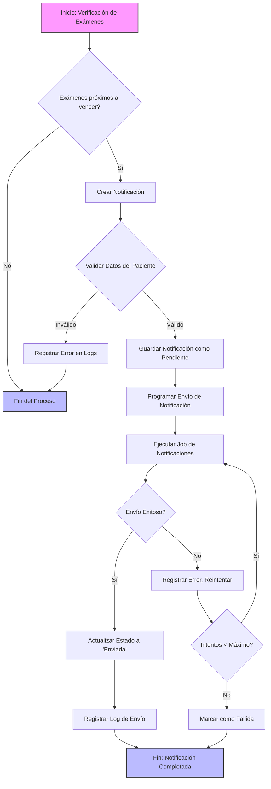

# Diagrama de Flujo: Sistema de Notificaciones de Exámenes

## Descripción del Diagrama

### Proceso Principal
1. **Verificación de Exámenes**: Se revisan los exámenes próximos a vencer
2. **Creación de Notificación**: Si hay exámenes por vencer, se crea una notificación
3. **Validación de Datos**: Se verifican los datos del paciente
4. **Programación de Envío**: Se programa el job de notificaciones
5. **Envío y Actualización**: Se envía la notificación y se actualiza su estado

### Manejo de Errores
- Validación de datos del paciente
- Control de intentos de envío
- Registro de logs para seguimiento

### Estados de Notificación
- Pendiente
- Enviada
- Fallida

## Componentes Involucrados
- ExamenNotificationService
- GenerarNotificacionesExamenesJob
- Modelo de Notificación
- Sistema de Colas de Laravel

## Consideraciones
- Procesamiento asíncrono
- Tolerancia a fallos
- Registro detallado de eventos
