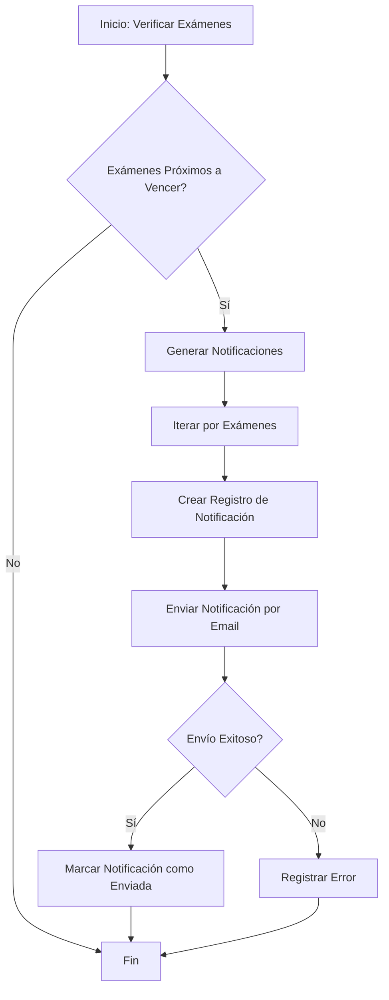

# Sistema de Notificaciones de Vencimiento de Exámenes Médicos

## Descripción General

### Objetivo
Sistema automatizado para notificar a pacientes sobre exámenes médicos próximos a vencer, mejorando el seguimiento preventivo en salud.

### Características Principales
- Notificaciones personalizadas por tipo de examen
- Envío programado de recordatorios
- Soporte para múltiples tipos de exámenes
- Manejo de errores y logging

## Arquitectura

### Componentes
1. **Trait**: `TieneNotificacionesVencimiento`
   - Añade funcionalidad de notificación a modelos de exámenes
   - Método para generar notificaciones
   - Scope para identificar exámenes próximos a vencer

2. **Servicio**: `NotificacionService`
   - Gestiona generación y envío de notificaciones
   - Procesa exámenes próximos a vencer
   - Maneja errores de envío

3. **Notificación**: `ExamenVencimientoNotification`
   - Configura contenido de notificaciones
   - Soporta múltiples canales (email, base de datos)

### Flujo de Trabajo


## Configuración

### Requisitos
- Laravel 9+
- PHP 8.1+
- Configuración de colas
- Servicio de correo configurado

### Instalación
1. Clonar repositorio
2. Instalar dependencias: `composer install`
3. Configurar `.env`
4. Ejecutar migraciones: `php artisan migrate`
5. Configurar scheduler

### Variables de Entorno
```
MAIL_MAILER=smtp
MAIL_HOST=mailhog
MAIL_PORT=1025
QUEUE_CONNECTION=database
```

## Comandos Útiles

```bash
# Generar notificaciones manualmente
php artisan notificaciones:vencimiento

# Ejecutar pruebas
php artisan test --filter NotificacionesVencimientoTest

# Iniciar worker de cola
php artisan queue:work
```

## Estrategias de Seguridad
- Encriptación de datos sensibles
- Logging de intentos de notificación
- Manejo de errores
- Cumplimiento de GDPR

## Mejoras Futuras
- Soporte para más canales de notificación
- Panel de configuración de preferencias
- Métricas de entrega de notificaciones

## Troubleshooting
- Verificar configuración de correo
- Revisar logs de notificaciones
- Comprobar estado de la cola

## Licencia
[Especificar licencia del proyecto]

## Contacto
[Información de contacto del equipo de desarrollo]
