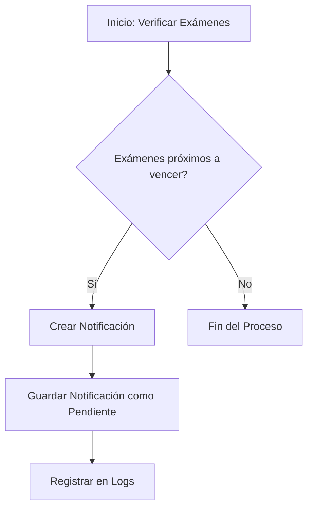
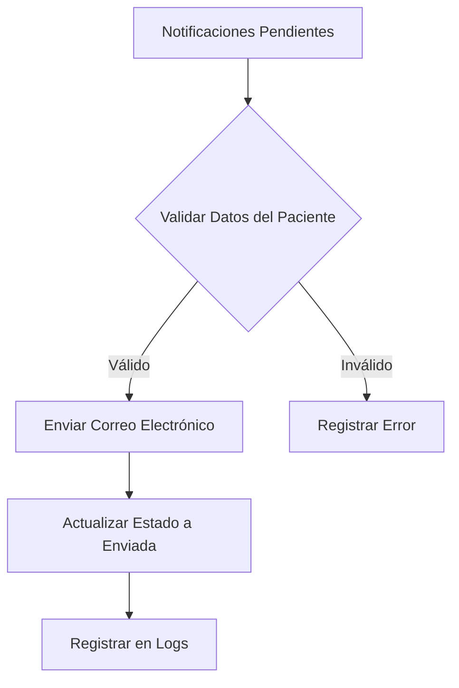

# Sistema de Notificaciones de Exámenes en VitamHC

## 1. Descripción General

El sistema de notificaciones de exámenes es un componente crítico de VitamHC que automatiza la comunicación con pacientes sobre exámenes próximos a vencer o que requieren seguimiento.

## 2. Arquitectura del Sistema

### 2.1 Componentes Principales

1. **ExamenNotificationService**
   - Servicio central para gestión de notificaciones
   - Ubicación: `app/Services/ExamenNotificationService.php`
   - Responsabilidades:
     * Generar notificaciones para exámenes próximos a vencer
     * Manejar la lógica de creación y envío de notificaciones

2. **GenerarNotificacionesExamenesJob**
   - Job asíncrono para procesar notificaciones
   - Ubicación: `app/Jobs/GenerarNotificacionesExamenesJob.php`
   - Funciones:
     * Programar y ejecutar generación de notificaciones
     * Manejar reintentos y control de errores

3. **ProgramarNotificacionesExamenesCommand**
   - Comando de consola para programar jobs de notificaciones
   - Ubicación: `app/Console/Commands/ProgramarNotificacionesExamenesCommand.php`
   - Características:
     * Permite configurar días de anticipación
     * Despacha jobs de notificaciones

4. **ExamenNotificacionMail**
   - Clase de correo para formatear notificaciones
   - Ubicación: `app/Mail/ExamenNotificacionMail.php`
   - Responsabilidades:
     * Generar plantilla de correo electrónico
     * Formatear información del examen

## 3. Flujo de Trabajo de Notificaciones

### 3.1 Generación de Notificaciones



### 3.2 Envío de Notificaciones



## 4. Configuración y Personalización

### 4.1 Parámetros Configurables

- **Días de Anticipación**: Configurable, valor por defecto 30 días
- **Canales de Notificación**: 
  * Email (principal)
  * Base de datos
  * SMS (futuro)

### 4.2 Ejemplo de Configuración

```php
// Generar notificaciones con 45 días de anticipación
$notificaciones = $notificationService->generarNotificacionesVencimiento(
    false,   // Modo de prueba
    45       // Días de anticipación
);
```

## 5. Gestión de Errores y Logs

### 5.1 Tipos de Errores Manejados

1. Paciente sin email
2. Fallo en envío de correo
3. Errores de base de datos
4. Timeouts en procesamiento

### 5.2 Registro de Logs

Niveles de log:
- `INFO`: Eventos normales de proceso
- `ERROR`: Fallos críticos
- `WARNING`: Problemas potenciales

Información registrada:
- ID de notificación
- ID de examen
- Tipo de examen
- Estado de la notificación
- Detalles de error (si aplica)

## 6. Comandos de Consola

### 6.1 Programar Notificaciones

```bash
# Generar notificaciones para exámenes próximos a vencer
php artisan notificaciones:programar --dias=30 --queue=default
```

### 6.2 Enviar Notificaciones Pendientes

```bash
# Enviar notificaciones pendientes manualmente
php artisan notificaciones:enviar
```

## 7. Consideraciones de Seguridad

- Validación de datos de pacientes
- No almacenamiento de información sensible
- Uso de colas para procesamiento asíncrono
- Manejo de errores sin exponer información confidencial

## 8. Rendimiento y Escalabilidad

- Procesamiento asíncrono mediante jobs
- Soporte para múltiples canales de notificación
- Configuración flexible de anticipación de notificaciones

## 9. Mejoras Futuras

1. Soporte para más canales de notificación (SMS, Telegram)
2. Personalización de plantillas de notificación
3. Integración con sistemas de seguimiento de pacientes
4. Análisis de efectividad de notificaciones

## 10. Troubleshooting

### Problemas Comunes

1. **No se generan notificaciones**
   - Verificar configuración de días de anticipación
   - Revisar logs de errores
   - Comprobar estado de exámenes en base de datos

2. **Notificaciones no enviadas**
   - Validar configuración de email
   - Verificar permisos de envío
   - Consultar logs de errores

## 11. Dependencias

- Laravel Framework
- Carbon (manipulación de fechas)
- Eloquent ORM
- Queue Worker (Redis/Database)

## 12. Instalación y Configuración

1. Asegurar configuración de colas (`config/queue.php`)
2. Configurar trabajador de colas
3. Verificar configuración de email

```bash
# Iniciar trabajador de colas
php artisan queue:work
```

## 13. Ejemplos de Uso

```php
// Generar notificaciones
$service = app(ExamenNotificationService::class);
$notificaciones = $service->generarNotificacionesVencimiento(false, 30);

// Enviar notificaciones pendientes
$service->enviarNotificaciones(
    Notificacion::where('estado', 'pendiente')->get()
);
```

## 14. Licencia y Créditos

Sistema desarrollado por VitamHC - Todos los derechos reservados.

---

**NOTA**: Esta documentación está sujeta a cambios. Última actualización: 13/02/2025
