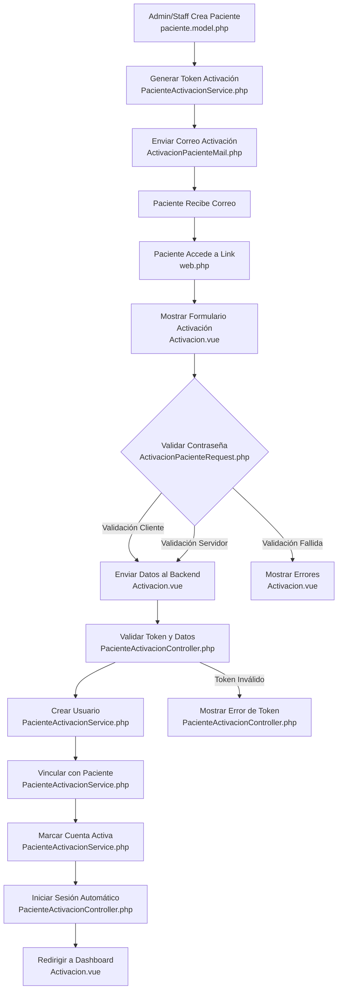

# Documentación Técnica: Sistema de Activación de Cuenta de Pacientes

## 1. Descripción General

### Objetivo
Implementar un proceso seguro de activación de cuenta para pacientes en el sistema e-Salud, garantizando la integridad de la información y la seguridad del usuario.

### Componentes Principales
- Backend: Laravel PHP
- Frontend: Vue.js con Inertia
- Base de Datos: PostgreSQL

## 2. Flujo de Activación

### 2.1 Generación de Token
```php
public function generarTokenActivacion(Paciente $paciente): string
```
- Genera token único de 64 caracteres
- Almacena hash del token
- Establece tiempo de expiración (24 horas)

### 2.2 Envío de Correo
```php
public function enviarCorreoActivacion(Paciente $paciente): bool
```
- Genera token de activación
- Envía correo con link de activación
- Maneja errores de envío

### 2.3 Validación de Token
```php
public function validarToken(string $tokenPlano): Paciente
```
- Verifica existencia del token
- Comprueba no expiración
- Valida integridad del token

### 2.4 Activación de Cuenta
```php
public function activarCuenta(string $tokenPlano, array $datosUsuario): User
```
- Pasos de activación:
  1. Validar token
  2. Validar datos de usuario
  3. Crear usuario
  4. Vincular con paciente
  5. Eliminar token de activación

## 3. Validaciones de Seguridad

### 3.1 Requisitos de Contraseña
```php
'password' => [
    'required', 
    'confirmed',
    'min:12', 
    'regex:/^(?=.*[a-z])(?=.*[A-Z])(?=.*\d)(?=.*[@$!%*?&])[A-Za-z\d@$!%*?&]+$/'
]
```
- Mínimo 12 caracteres
- Mayúsculas y minúsculas
- Números
- Caracteres especiales

### 3.2 Validación de Token
- Token único de 64 caracteres
- Almacenamiento seguro (hash)
- Tiempo de expiración
- Validación de integridad

## 4. Manejo de Errores

### 4.1 Excepciones Personalizadas
- `TokenActivacionInvalidoException`
- Registro de intentos fallidos
- Bloqueo de IP tras múltiples intentos

### 4.2 Logging
- Registro de eventos:
  - Generación de token
  - Envío de correo
  - Intentos de activación
  - Activación exitosa

## 5. Eventos

### 5.1 Eventos Disparados
```php
event(new PacienteActivado($paciente, $user));
```
- `PacienteRegistrado`
- `CorreoActivacionEnviado`
- `CuentaActivada`

## 6. Consideraciones de Seguridad

### 6.1 Protección contra Ataques
- Rate limiting
- Validación de correo electrónico
- HTTPS
- Headers de seguridad
- Content Security Policy

### 6.2 Manejo de Credenciales
- Uso de `Hash::make()` para contraseñas
- Almacenamiento solo de hash
- Rotación de tokens

## 7. Diagrama de Flujo Detallado



### Descripción de Archivos en el Flujo

| Archivo | Responsabilidad |
|---------|-----------------|
| `paciente.model.php` | Modelo de datos del paciente |
| `PacienteActivacionService.php` | Lógica principal de activación |
| `ActivacionPacienteMail.php` | Generación y envío de correo de activación |
| `web.php` | Definición de rutas |
| `Activacion.vue` | Interfaz de usuario para activación |
| `ActivacionPacienteRequest.php` | Validación de datos de entrada |
| `PacienteActivacionController.php` | Controlador de activación |

## 8. Consideraciones de Implementación

### 8.1 Dependencias
- Laravel
- Vue.js
- Inertia.js
- Vuetify
- PostgreSQL

### 8.2 Configuración Recomendada
- Usar variables de entorno
- Configurar tiempo de expiración de token
- Personalizar mensajes de error

## 9. Mejoras Futuras
- Implementar autenticación de dos factores
- Integrar CAPTCHA
- Mejorar sistema de notificaciones
