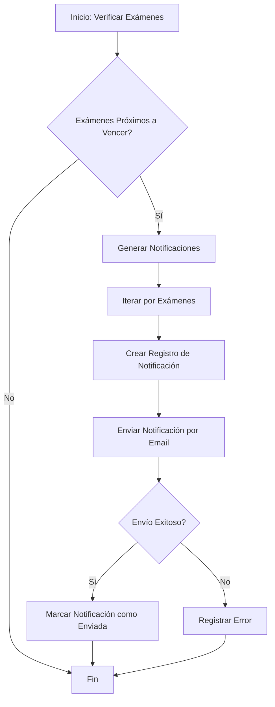
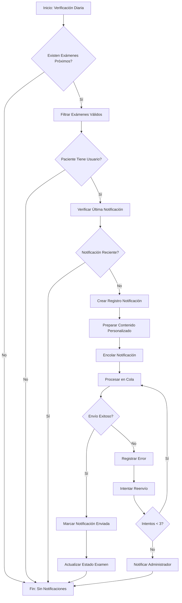

# Sistema de Notificaciones de Vencimiento de Exámenes Médicos

## Descripción General

### Objetivo
Sistema automatizado para notificar a paciente sobre exámenes médicos próximos a vencer, mejorando el seguimiento preventivo en salud.

### Características Principales
- Notificaciones personalizadas por tipo de examen
- Envío programado de recordatorios
- Soporte para múltiples tipos de exámenes
- Manejo de errores y logging

## Arquitectura

### Componentes
1. **Trait**: `TieneNotificacionesVencimiento`
   - Añade funcionalidad de notificación a modelos de exámenes
   - Método para generar notificaciones
   - Scope para identificar exámenes próximos a vencer

2. **Servicio**: `NotificacionService`
   - Gestiona generación y envío de notificaciones
   - Procesa exámenes próximos a vencer
   - Maneja errores de envío

3. **Notificación**: `ExamenVencimientoNotification`
   - Configura contenido de notificaciones
   - Soporta múltiples canales (email, base de datos)

### Flujo de Trabajo


## Flujo Detallado de Notificaciones de Exámenes

### Proceso Completo de Notificación

#### 1. Detección de Exámenes Próximos a Vencer
- **Trigger**: Ejecución diaria del comando `notificaciones:vencimiento`
- **Criterios de Selección**:
  * Exámenes con fecha de próximo control dentro de los próximos 60 días
  * Estado del examen: Activo
  * Paciente con usuario registrado
  * No haber recibido notificación en los últimos 7 días

#### 2. Generación de Notificaciones
- **Servicio**: `NotificacionService::generarNotificacionesVencimiento()`
- **Pasos**:
  1. Consultar modelos de exámenes registrados
  2. Aplicar scope `proximosAVencer()`
  3. Filtrar exámenes sin notificación reciente
  4. Crear registro de notificación en base de datos

#### 3. Preparación de Contenido de Notificación
- **Clase**: `ExamenVencimientoNotification`
- **Contenido Personalizado**:
  * Nombre del paciente
  * Tipo de examen
  * Fecha de próximo control
  * Días restantes
  * Comentarios adicionales

#### 4. Canales de Notificación
- **Canales Actuales**:
  1. Email (principal)
  2. Base de datos (registro interno)
- **Canales Futuros**:
  * SMS
  * Notificaciones push
  * Whatsapp

#### 5. Proceso de Envío
- **Método**: Colas de Laravel (`ShouldQueue`)
- **Pasos**:
  1. Encolar notificación
  2. Iniciar worker de colas
  3. Procesar notificación
  4. Registrar resultado

#### 6. Manejo de Errores
- **Estrategias**:
  * Registro de logs para cada intento
  * Máximo 3 intentos de reenvío
  * Notificación al administrador si falla
  * Marcado de notificación como fallida

### Diagrama de Flujo Extendido


### Casos de Prueba
1. **Escenario Feliz**
   - Examen próximo a vencer
   - Paciente con usuario activo
   - Envío de notificación exitoso

2. **Escenario de Error**
   - Paciente sin usuario
   - Notificación ya enviada recientemente
   - Fallo en envío de email

3. **Escenario Límite**
   - Examen en el último día de notificación
   - Múltiples exámenes para un paciente

### Consideraciones de Seguridad
- Encriptación de datos personales
- Consentimiento para notificaciones
- Cumplimiento de normativas de privacidad

### Métricas y Monitoreo
- Tasa de entrega de notificaciones
- Tiempo de procesamiento
- Tasa de apertura de emails
- Registro de intentos fallidos

## Configuración

### Requisitos
- Laravel 9+
- PHP 8.1+
- Configuración de colas
- Servicio de correo configurado

### Instalación
1. Clonar repositorio
2. Instalar dependencias: `composer install`
3. Configurar `.env`
4. Ejecutar migraciones: `php artisan migrate`
5. Configurar scheduler

### Variables de Entorno
```
MAIL_MAILER=smtp
MAIL_HOST=mailhog
MAIL_PORT=1025
QUEUE_CONNECTION=database
```

## Comandos Útiles

```bash
# Generar notificaciones manualmente
php artisan notificaciones:vencimiento

# Ejecutar pruebas
php artisan test --filter NotificacionesVencimientoTest

# Iniciar worker de cola
php artisan queue:work
```

## Estrategias de Seguridad
- Encriptación de datos sensibles
- Logging de intentos de notificación
- Manejo de errores
- Cumplimiento de GDPR

## Mejoras Futuras
- Soporte para más canales de notificación
- Panel de configuración de preferencias
- Métricas de entrega de notificaciones

## Troubleshooting
- Verificar configuración de correo
- Revisar logs de notificaciones
- Comprobar estado de la cola

## Licencia
[Especificar licencia del proyecto]

## Contacto
[Información de contacto del equipo de desarrollo]
